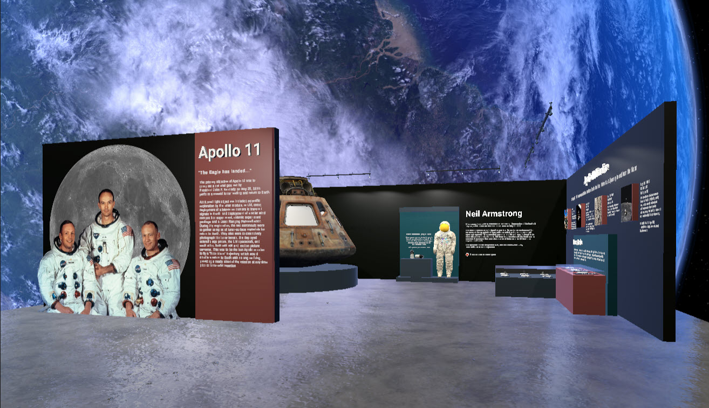

# 
Apollo 11 VR Museum

  <a href="https://github.com/aprilspeight/apollo-11/blob/master/README.md#requirements">Requirements</a> |
  <a href="https://github.com/aprilspeight/apollo-11/blob/master/README.md#videos">Video</a> |
  <a href="https://github.com/aprilspeight/apollo-11/blob/master/README.md#view-the-sample">View the Sample</a> |
  <a href="https://github.com/aprilspeight/apollo-11/blob/master/README.md#resources">Resources</a> | 
  <a href="https://github.com/aprilspeight/apollo-11/blob/master/README.md#contact">Contact</a>

For this <i>Made with MRTK</i> project, I decided to revisit my love of space exploration and bring the educational experience into VR. I created my very own interactive Apollo 11 exhibit with 3D models courtesy of the Smithsonian 3D Digitization project and NASA.

## Requirements

- Unity 2020.3.37f1
- Meta Quest or Meta Quest 2
- Quest Link cable (to view on device via Unity in Play mode)

## Videos

A demo of the project is available on YouTube. Check out the video here: [https://youtu.be/H5a1kmKHmoo](https://youtu.be/H5a1kmKHmoo)

## View the Sample

<b>Disclaimer</b>: I have two disclaimers folks. First, you <b>must</b> create an Azure Speech Service to use the transcription feature that accompanies the <b>Neil Armstrong</b> and <b>Command Module</b> exhibits. New to Azure? No worries! You can sign-up for a free account by visiting: [https://azure.microsoft.com/free/](https://azure.microsoft.com/free/)

Second, this experience has <b>only</b> been optimized to view via the Quest Link workflow (aka connecting the Meta Quest to your computer and pressing <b>Play</b> in Unity). Should you decide to deploy the experience to your device, you'll be responsible for modifying to better suit optimization for the device.

With the business out of the way, let's view the sample!

1. Ensure that you have <b>Android Build Support</b> and it's corresponding modules for <b>Unity 2020.3.37f1</b>.
1. Clone or download this repository and add the project to the Unity Hub.
1. Open the project in Unity.
1. The <b>MRTK Project Configurator</b> window will appear. Click <b>Next</b>. On the following screen click <b>Apply</b>. And on the next screen click <b>Next</b>.
1. On the next screen of the <b>MRTK Project Configurator</b>, click <b>Import TMP Essentials</b>. And then on the next screen click <b>Done</b>.
1. In the <b>Project</b> panel, navigate to <b>Assets/Scenes</b> and open the <b>Exhibit</b> scene.
1. Enable <b>Developer Mode</b> for your Meta Quest or Meta Quest 2. To do so, follow steps 1-7 within [<i>Connect Headset over USB</i>](https://developer.oculus.com/documentation/unity/unity-enable-device/#connect-headset-over-usb). <b>DO NOT BUILD AND RUN</b>. 

    If your device is already in <b>Developer Mode</b>, then connect your device to your computer via the Quest Link cable, put on the headset, and click <b>Allow</b> when promoted to allow access to data.

    After your device is connected to the computer <b>and</b> in Developer Mode, open the <b>Quest Link</b> app on the device. You'll likely be prompted to open Quest Link after completing the prior step to allow access to data.
1. Within Unity, in the <b>Hierarchy</b>, select the <b>Exhibit-Descriptions</b> GameObject.
1. In the <b>Inspector</b>, add your <b>Speech Service Subscription Key</b> and <b>Speech Service Region</b> for the Azure Speech resource that was mentioned in the disclaimer. You can find these two values within the <b>Keys and Endpoint</b> section of the Azure Portal for your Speech service resource. If you <b>do not</b> intend to use the transcription feature of the experience (pressing the red button to generate an audio clip playback for the text on the wall) then you can ignore this step.
1. Press <b>Play</b>. The Meta Quest/Meta Quest 2 will start the experience within <b>Quest Link</b>. If the Quest Link app is not already opened, the device will provide a pop-up link to the app for you to open.

You can teleport in the scene and grab the gloves that are against the wall. The red button on the wall can be pressed as well. You can use either the Quest controllers or your hands (if enabled for your device).

## Resources

- [MRTK](https://aka.ms/mrtk)
- [Smithsonian 3D Digitization](https://3d.si.edu/)
- [NASA Astromaterials 3D](https://ares.jsc.nasa.gov/astromaterials3d/)

## Contact

Have a question or issue trying the sample? Submit an issue to the repo!
